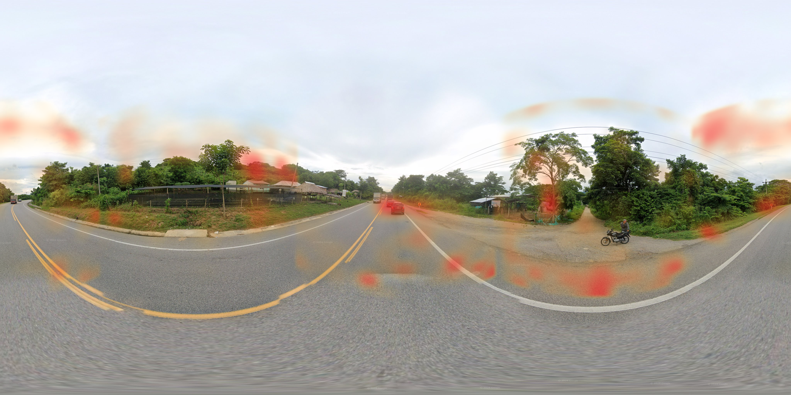

# geoai

Two-stage, fully local, open-weights image geolocation for Google Street View
panoramas (the GeoGuessr setting). Zero recurring API cost; tuned for a dual
RTX 4090 workstation.

- **Stage 1** — a `SigLIP2-SO400M` vision backbone feeding an autoregressive
  hierarchical S2-cell classifier (levels 3/6/9/12), with a **ProtoNet
  content-aware selector** that picks the final cell by image-feature similarity.
- **Stage 2** (optional) — a Gemma-4-26B vision-language layer that reads on-image
  text (OCR → VLM → geocode) to pinpoint *within* Stage 1's region.



> *Occlusion attribution — slide an occluder across each view, measure how much it
> shifts the ProtoNet match, and project the result back onto the equirectangular
> pano. Brighter red = the model relied on that region more. Rural scenes lean on
> the roadway, vegetation, and horizon rather than any single landmark.*

## Results

Deployed model (`stage1_v3_long/epoch_04` + ProtoNet-select, $K{=}500$), evaluated
on 4,000 random held-out test panoramas:

| median | mean | < 1 km | < 25 km | < 200 km | < 500 km | < 750 km |
| :---: | :---: | :---: | :---: | :---: | :---: | :---: |
| **24.9 km** | 82.8 km | 4.4% | **50.1%** | 90.2% | 98.1% | 99.1% |

## The finding: selection, not capacity

Across three training generations the validation median plateaued near 78 km, and
fine-grained accuracy stalled (within-25 km ≈ 22%) despite more data and training.
A short battery of diagnostics showed the bottleneck was **selection, not the
model**: an oracle that perfectly classifies to the finest cell hits a 5.4 km
median, and the true L9 cell is in the model's top-50 candidates 93.5% of the time
(given correct coarse context). The heads find the right cell; the model's
**density-biased probability can't rank it first**.

Replacing that ranker with **ProtoNet feature-similarity** over the top-K
candidate cells — picking the cell whose stored prototypes best match the query
image — recovers most of the lost accuracy, **with no retraining**:

| | median | mean | within 25 km |
| --- | :---: | :---: | :---: |
| greedy (probability top-1) | ~70 km | ~110 km | ~20% |
| **ProtoNet-select** ($K{=}500$) | **24.9 km** | **82.8 km** | **50.1%** |

It also *simplified* the system: every candidate-masking "cascade mode" hurt once
the selector was active, so Stage 1 is a single path (raw logits → select). The
full study, including the per-country breakdown, is in
[`paper/geoai_paper.md`](paper/geoai_paper.md).

## Architecture (Stage 1)

| Component | Choice |
| --- | --- |
| Backbone | `google/siglip2-so400m-patch14-384`, full-finetune |
| View pooling | Concat across 4 perspective crops (90° FOV at headings 0/90/180/270) |
| Head | Autoregressive over levels L3/6/9/12 — each conditions on a 256-d embedding of the previous (GeoToken-style) |
| Loss | Haversine-smoothed soft-CE per level + auxiliary country CE + cross-country border penalty |
| Selection | ProtoNet L9 retrieval similarity over the top-$K$ candidate cells (1.94M prototypes, 119,026 cells) |
| Compute | 2× RTX 4090, bf16, `torch.compile`, gradient checkpointing |

S2 cell sizes (avg edge): L3 ~1150 km, L6 ~144 km, L9 ~18 km, L12 ~2.3 km. See
[`TECHNICALS.md`](TECHNICALS.md) for a full code walkthrough and
[`paper/geoai_paper.md`](paper/geoai_paper.md) for the technical report.

## Stage 2 (optional reasoning layer)

For text-rich panoramas, `refined` mode runs: Surya OCR → language ID → NLLB
translation → **Gemma 4 26B** (via an OpenAI-compatible LM Studio endpoint) →
Nominatim geocode → country-sanity check. It overrides Stage 1 only when it finds a
specific OSM **point** feature near Stage 1's guess; otherwise it defers. Its chief
use is visually-homogeneous countries (e.g. Japan, where pixels alone are
ambiguous and the disambiguating signal is on-image text).

## Setup

Python 3.11 is required (Unsloth's Gemma 4 MoE support, for Stage 2).

```bash
python3.11 -m venv .venv
.venv/bin/pip install -e .
# torch from PyTorch's CUDA wheel index:
.venv/bin/pip install --index-url https://download.pytorch.org/whl/cu128 torch torchvision
.venv/bin/python -c "import geoai.config; print(geoai.config.DATA_ROOT)"   # /data/geolocation
```

A `run.py` wrapper covers the same commands without the venv path
(`python run.py serve|train|scrape|help`).

## Usage

```bash
# Data pipeline (resumable; reads/writes /data/geolocation)
.venv/bin/geoai-catalog            # CSV + GADM + S2 + climate + pop → SQLite
.venv/bin/geoai-render-crops       # equirect → 4× 384px perspective JPEGs
.venv/bin/geoai-split              # deterministic location-level held-out split
.venv/bin/geoai-cell-stats --out-path .../cells_v3.parquet

# Train Stage 1 (dual-GPU)
.venv/bin/accelerate launch --num_processes 2 .venv/bin/geoai-train-stage1 \
  --cells-parquet .../cells_v3.parquet --country-loss-weight 0.3 \
  --border-lambda 0.5 --compile

# Build the ProtoNet L9 index (supports --shard/--num-shards for dual-GPU)
.venv/bin/python scripts/build_protonet_index.py \
  --ckpt .../stage1_v3_long/epoch_04 --out .../epoch_04/protonet_l9.pt \
  --cells-parquet .../cells_v3.parquet --max-per-cell 50

# Serve (FastAPI; ProtoNet-select on by default; auto-loads <ckpt>/protonet_l9.pt)
.venv/bin/geoai-serve --ckpt .../stage1_v3_long/epoch_04 \
  --cells-parquet .../cells_v3.parquet --device cuda:0
```

The userscript (`script.js`, Tampermonkey) plays live on geoguessr.com against the
server, with two modes: **ProtoNet (Stage 1)** and **+ Stage 2 (OCR/VLM)**.

## Repository layout

```
geoai/
  config.py            data paths, raster/GADM lookups, env overrides
  scraper/             Street View scraper (parked, functional)
  processing/          catalog + crop renderer + reverse geocoding
  stage1/              model, loss, dataset, predict (ProtoNet-select), protonet, eval
  stage2/              OCR (extract) + pinpoint (Gemma) + geocode + refine
  serve/               FastAPI inference server
scripts/               ProtoNet index build (+ dual-GPU shard/merge)
paper/                 technical report (Markdown + figures)
TECHNICALS.md          code/architecture walkthrough + gotchas
```

## Constraints

- **Open weights only** — no proprietary models at train or inference.
- **Data lives on `/data/geolocation/`**, never in the repo; read in place via
  `geoai.config` (override with `GEOAI_DATA_ROOT`).
- **Resumable by construction** — catalog, crop render, and scraper dedupe so
  kill/restart is always safe.

Non-obvious gotchas (S2 cell IDs stored as TEXT, SigLIP 0.5/0.5 normalization,
GHS-POP Mollweide reprojection, location-level splits, …) are documented in
[`TECHNICALS.md`](TECHNICALS.md).
