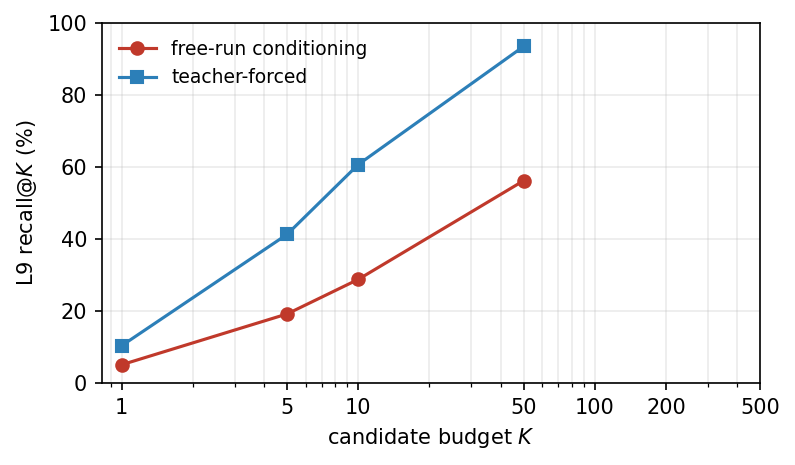
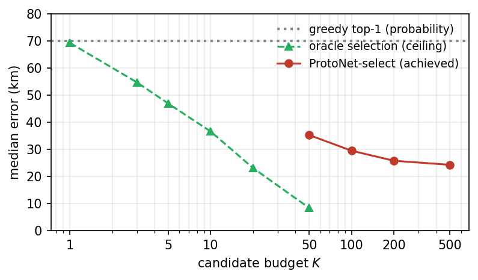

# It Was Never the Model: Selection, Not Capacity, Is the Bottleneck in Hierarchical Street-View Geolocation

*geoai project — technical report.*

## Abstract

We study a two-stage, fully local, open-weights system for image geolocation from
Google Street View panoramas. A SigLIP2 vision backbone feeds an autoregressive
hierarchical S2-cell classifier (levels 3/6/9/12); cells are converted to
coordinates and optionally refined. Over three training generations
(920K → 2.0M → 2.4M panoramas) the validation median error plateaued near 78 km,
and additional training, data, and a loss-sharpening ablation each promised only
marginal gains. A sequence of cheap diagnostics then revealed that the limiter was
*not* model capacity, cell granularity, or coverage: an oracle that perfectly
classifies to the finest cell achieves a 5.4 km median, and the true L9 cell sits
in the model's top-50 candidates 93.5% of the time given correct coarse context.
The model produces a rich candidate set but ranks it with a density-biased
probability that cannot pick the right cell. We show that replacing the probability
ranker with a *content-aware selector* — ProtoNet feature-similarity over the top-$`K`$
candidates — cuts the median error from ~73 km to ~26 km and more than doubles
accuracy within 25 km (19% → 49%), **with no retraining**. A per-country analysis
isolates the residual failure mode: countries that are *visually homogeneous* at
national scale (Japan: 68K training panos, 0.98 mean match similarity, yet 131 km
median error) cannot be solved by vision at all and require reading on-image text,
while visually varied countries (Indonesia: ~360 km → 48 km) are fixed by selection
alone.

## 1. Introduction

Image geolocation is commonly framed as hierarchical cell classification: partition
the globe into a multi-resolution grid, classify the containing cell at each
resolution, and convert the predicted cell to a coordinate. This sidesteps the
pathological loss surface of direct latitude/longitude regression and provides a
natural notion of "close but not exact."

Our system targets Street-View geolocation (the GeoGuessr setting) under hard
constraints: fully local, open-weights, zero recurring API cost, on a dual RTX 4090
workstation. Across three generations of training we observed a familiar
trajectory: each generation improved aggregate metrics, but the marginal return on
more training and data shrank, and the validation median stalled near 78 km. The
natural next moves — a larger backbone, a finer cell scheme, a sharper loss, or a
sequence-decoder rework — all target the *model*.

Our central finding is that the model was never the bottleneck. With a short
battery of diagnostics we show the deployed accuracy was throttled by *selection*:
the heads already place the correct cell among their top candidates, but the
model's own probabilities — biased toward data-dense cells — fail to rank it first.
A content-aware selector recovers most of this lost accuracy at inference time, with
no parameter updates. We then use a per-country breakdown to characterize what
remains, and find it is dominated by *visual homogeneity* rather than data scarcity.

**Contributions.**
(i) A diagnostic methodology — oracle floors, per-level recall@$`K`$ under free-run
vs. teacher-forced conditioning, and oracle selection curves — that localizes error
to *selection* rather than capacity, granularity, coverage, or quantization.
(ii) ProtoNet-as-selector: using retrieval similarity (not probability) to pick
among the top-$`K`$ candidate cells, yielding a large, training-free accuracy gain and
*simplifying* the inference cascade. (iii) A per-country analysis that cleanly
separates two residual failure modes — internal visual homogeneity and cross-border
look-alikes — and argues both require an orthogonal modality (on-image text), not
more vision data.

## 2. System Overview (Stage 1)

**Table 1 — Notation.**

| Symbol | Meaning |
| --- | --- |
| $`x`$, $`x^{(v)}`$ | panorama; its $`v`$-th perspective crop ($`v \in \{1,\dots,4\}`$) |
| $`g(\cdot)`$, $`\phi`$ | per-view SigLIP encoder; concat-pool projection |
| $`z \in \mathbb{R}^{1024}`$ | pooled panorama feature |
| $`\mathcal{L}`$, $`\mathcal{C}_\ell`$ | S2 levels $`\{3,6,9,12\}`$; level-$`\ell`$ cell vocabulary |
| $`u_\ell`$, $`p_\ell`$ | level-$`\ell`$ logits; softmax probabilities $`p_\ell(\cdot \mid x)`$ |
| $`E_\ell`$ | embedding of the coarser predicted cell (→ $`\mathbb{R}^{256}`$) |
| $`\hat c_\ell`$, $`c^\star_\ell`$ | predicted vs. ground-truth level-$`\ell`$ cell |
| $`d(\cdot,\cdot)`$, $`\sigma_\ell`$ | great-circle distance; per-level soft-target bandwidth |
| $`q_\ell`$ | haversine-smoothed soft target over $`\mathcal{C}_\ell`$ |
| $`P_c`$, $`s(z,c)`$ | stored prototypes of cell $`c`$; content (cosine) score |
| $`K`$, $`\Delta_K`$ | candidate budget; selection gap (greedy − oracle-$`K`$) |

**Backbone and pooling.** A `SigLIP2-SO400M` vision encoder (patch14, 384 px) is
full-finetuned. Each panorama $`x`$ is rendered into four perspective crops
$`\{x^{(v)}\}_{v=1}^{4}`$ at headings 0/90/180/270° (90° FOV). With per-view
embeddings $`g(x^{(v)}) \in \mathbb{R}^{1152}`$, the pooled feature is

```math
z = \phi\big([\,g(x^{(1)});g(x^{(2)});g(x^{(3)});g(x^{(4)})\,]\big) \in \mathbb{R}^{1024},
```

where $`\phi`$ is a GELU–LayerNorm projection. Concatenation (vs. mean-pooling)
preserves per-view evidence, and a random heading-rotation augmentation supplies
heading invariance.

**Hierarchical head.** Let $`\mathcal{L} = \{3,6,9,12\}`$ index the S2 resolutions
(average edge ≈ 1150/144/18/2.3 km) with pruned cell vocabularies $`\mathcal{C}_\ell`$
of size 175/4024/119,026/45,946. Logits are produced autoregressively from coarse
to fine in the GeoToken style,

```math
u_\ell = W_\ell\,[\,z\,;\,E_\ell(\hat c_{\ell-1})\,], \qquad p_\ell(\cdot \mid x) = \mathrm{softmax}(u_\ell),
```

where $`E_\ell : \mathcal{C}_{\ell-1} \to \mathbb{R}^{256}`$ embeds the coarser cell
($`\hat c_{\ell-1}`$ is the ground-truth cell under teacher forcing and
$`\arg\max p_{\ell-1}`$ at inference; the coarsest head $`u_3`$ conditions on $`z`$ alone).
An auxiliary 135-way country head reads the same pooled feature $`z`$.

**Loss.** Let $`d(\cdot,\cdot)`$ be great-circle distance and $`c^\star_\ell`$ the true
level-$`\ell`$ cell. The target is a haversine-smoothed (soft) distribution that
decays with distance from the truth, so a near-miss is rewarded over a far one,

```math
q_\ell(c) \;\propto\; \exp\!\Big(-\frac{d(c,c^\star_\ell)^2}{2\sigma_\ell^2}\Big), \qquad \sigma = \{2000,500,100,20\}\ \text{km},
```

and the objective is the per-level soft cross-entropy plus an auxiliary country term
and a cross-border penalty,

```math
\mathcal{L} = \sum_{\ell \in \mathcal{L}}\Big(-\!\!\sum_{c \in \mathcal{C}_\ell} q_\ell(c)\,\log p_\ell(c \mid x)\Big) + \lambda_{\text{ctry}}\,\mathcal{L}_{\text{ctry}} + \lambda_{\text{bord}}\,\mathcal{L}_{\text{bord}}.
```

**Coordinate read-out.** A predicted cell maps to its centroid; the greedy baseline
reads the centroid of $`\hat c_9 = \arg\max_c p_9(c \mid x)`$. A heuristic cascade
(catastrophic-jump fallback, L12-density trust, ProtoNet refinement) optionally
adjusts the final point. ProtoNet is a prebuilt L9 feature index: for each cell we
store the pooled embeddings of its training panoramas and, at inference, refine the
centroid toward the most similar known panoramas (§4).

## 3. The Plateau and Three Training Generations

Table 2 summarizes the three generations, each evaluated on its own (increasingly
hard) held-out split. Median error *rose* across generations not because the model
worsened but because the evaluation distribution broadened to cover sparsely-imaged
regions; the mean and tail steadily improved.

**Table 2 — Training generations.** Each is evaluated on its own held-out split
(sizes differ), so medians are not directly comparable across rows; the trend within
a generation and the mean/tail are the informative signals.

| Generation | Corpus | Val median (km) | Val mean (km) | country top-1 |
| --- | ---: | ---: | ---: | ---: |
| V1 (epoch 13) | 920K | 52.9 | — | — |
| V2 (epoch 10) | 2.03M | 79.0 | 236.1 | 0.990 |
| V3-long (epoch 4) | 2.39M | 77.9 | 169.7 | 0.992 |

The diagnostic question is why fine-grained accuracy stalls. At V3-long epoch 4,
within-200 km was 74% but within-25 km only 21.6%, and L9 top-1 accuracy was 2.8%.
The model reliably identifies the *region* but rarely the exact 18 km cell.

## 4. Diagnosis: It Is a Selection Problem

We ran four cheap experiments on the V3-long epoch-4 checkpoint (~1.2K test
panoramas unless noted).

**(1) Quantization is not the floor.** Replacing every prediction with the *true*
finest in-vocabulary cell's centroid (perfect classification) yields a **5.4 km**
median and 99.3% within-25 km (Table 3). The cells are plenty fine; the entire gap
to the deployed 73 km is classification error, not centroid quantization. A
within-cell regression head is therefore *not* warranted.

**Table 3 — Oracle "perfect-classification" floor (true cell → centroid).**

| Level used | median (km) | within-25 km | coverage |
| --- | ---: | ---: | ---: |
| L6 centroid | 45.0 | 21.6% | 100% |
| L9 centroid | 6.0 | 100% | 99.1% |
| L12 centroid | 0.7 | 100% | 16.7% |
| **finest available** | **5.4** | **99.3%** | **100%** |

**(2) The heads have the answer; the cascade poisons it.** We measured per-level
recall@$`K`$ (is the true cell among the top-$`K`$ logits?) under two regimes: *free-run*
(each level conditioned on the model's own coarse argmax) and *teacher-forced*
(conditioned on the true coarse cells) (Table 4, Figure 1). At L9, free-run
recall@10 is 28.8% but teacher-forced recall@10 is 60.7% and recall@50 is 93.5%. The
fine heads are capable; greedy coarse conditioning discards much of their accuracy.

**Table 4 — L9 recall@$`K`$ (true cell in top-$`K`$), 1.5K test panoramas.**

| Regime | @1 | @5 | @10 | @50 |
| --- | ---: | ---: | ---: | ---: |
| free-run (own conditioning) | 5.1% | 19.2% | 28.8% | 56.2% |
| teacher-forced (true coarse) | 10.4% | 41.3% | 60.7% | 93.5% |



*Figure 1 — L9 recall@$`K`$. With correct coarse context the fine head holds the true
cell 93.5% of the time at $`K{=}50`$; under its own greedy conditioning it loses much
of that. The headroom is conditioning/selection, not head capacity.*

**(3) Oracle selection bounds the prize.** Given the model's free-run L9 top-$`K`$, an
oracle that picks the candidate closest to truth achieves the curve in Table 5:
top-20 → 24 km, top-50 → 8.4 km. The good answer is in the candidate set; the
deployed greedy median is ~70 km. The entire gap is selection.

**Table 5 — Oracle selection over free-run L9 top-$`K`$ (ceiling for any selector).**

| top-$`K`$ | 1 | 3 | 5 | 10 | 20 | 50 |
| --- | ---: | ---: | ---: | ---: | ---: | ---: |
| median (km) | 69.3 | 54.7 | 46.9 | 36.6 | 23.1 | 8.4 |
| within-25 km | 21% | 31% | 36% | 44% | 52% | 66% |

**(4) The probability is a broken ranker.** Two attempts to re-rank with cheap
signals *worsened* accuracy: a full hierarchical beam search by joint log-probability
moved the median 71 → 124 km, and a count-debias re-rank ($`\text{logit} - \alpha\log\text{count}`$)
hurt at every $`\alpha`$. Probability-weighted averaging over the top-$`K`$ was
approximately neutral. The density bias is not a simple statistical artifact; it
lives in the learned feature/probability geometry, so only a content-aware selector
can exploit the candidate set.

## 5. ProtoNet as a Content-Aware Selector

We repurpose the ProtoNet L9 index (1.94M prototypes, 119,026 cells, avg 16.3 per
cell, $`d{=}1024`$) from a refiner into a *selector*. Let
$`P_c = \{z_i : \text{pano } i \in c\}`$ be cell $`c`$'s stored prototype features and
define the content score as the query's similarity to the cell's nearest prototype,

```math
s(z,c) = \max_{p \in P_c} \frac{\langle z,p\rangle}{\lVert z\rVert\,\lVert p\rVert}.
```

Where greedy decoding returns $`\arg\max_c p_9(c \mid x)`$, the selector instead
reranks the top-$`K`$ logit candidates by this score,

```math
\hat c_9 = \arg\max_{c\,\in\,\mathrm{Top}\text{-}K\,(p_9(\cdot \mid x))} s(z,c),
```

and reads $`\hat c_9`$'s retrieval-refined coordinate. Because $`s`$ is a function of
feature geometry alone, it is invariant to the cell-frequency prior that biases
$`p_9`$. We quantify the opportunity by the *selection gap*
$`\Delta_K = \mathrm{med}_{\text{greedy}} - \mathrm{med}_{\text{oracle-}K}`$ — the median
error recoverable by a perfect selector over the free-run top-$`K`$ — which exceeds
60 km at $`K{=}50`$ (Table 5).

Table 6 and Figure 2 report the selector across $`K`$. Accuracy improves monotonically
and plateaus around $`K \approx 200`$; the median drops ~73 → 26 km and within-25 km
rises ~19% → 49%. Refinement costs ~0.13 ms per candidate on GPU
($`K{=}200 \approx`$ 26 ms), negligible relative to the backbone forward.

**Table 6 — ProtoNet content-selector vs. greedy across candidate budget $`K`$.**
Absolute baselines vary ± with the random test sample; deltas are measured on
identical panoramas.

| Method | median (km) | mean (km) | within-25 km |
| --- | ---: | ---: | ---: |
| greedy (top-1 probability) | ~70 | ~110 | ~20% |
| ProtoNet-select $`K{=}50`$ | 35.3 | 84.0 | 43.0% |
| ProtoNet-select $`K{=}100`$ | 29.5 | 80.1 | 47.4% |
| **ProtoNet-select $`K{=}200`$** | **25.8** | **73.6** | **49.6%** |
| ProtoNet-select $`K{=}500`$ | 24.3 | 88.2 | 50.2% |
| oracle ($`K{=}200`$, ceiling) | 6.4 | 25.6 | 86.8% |



*Figure 2 — Median error vs. candidate budget $`K`$. The probability ranker (dotted)
leaves a wide gap to the oracle-selection ceiling (dashed); content-aware ProtoNet
selection (solid) captures most of it with no retraining. Greedy and oracle share a
common point at $`K{=}1`$ by construction.*

**The selector simplifies the system.** We had four cascade "modes" (country
masking, hierarchical masking, joint reranking). With the selector active, all
masking *hurts*: feeding the selector the raw top-$`K`$ gives a 30.2 km median vs.
35.5 km with the hierarchical cascade, and the country mask is a no-op. Masking
strips truth-near cells from the candidate set before the selector can choose them.
We therefore collapse the entire Stage-1 cascade to a single path: raw logits →
ProtoNet-select.

## 6. Per-Country Analysis: Homogeneity, Not Scarcity

We evaluate the deployed selector per country (stratified, ≤40 panos/country, 119
countries, 4306 panos): overall median 12.4 km, within-25 km 63%. The per-country
spread is the story (Table 7). Two failure modes dominate the tail, and *neither is
a data problem*.

**Table 7 — Selected countries.** "train" is corpus prototype supply; "sim" is mean
ProtoNet top-similarity of the selected cell.

| Country | train panos | median (km) | within-25 km | sim |
| --- | ---: | ---: | ---: | ---: |
| Japan | 67,855 | 131 | 23% | 0.981 |
| Indonesia | 68,874 | 48 | 32% | 0.958 |
| India | 133,313 | 117 | 5% | — |
| France | 20,541 | 119 | 23% | — |

**Internal homogeneity (Japan).** Japan is the single worst country despite ample
coverage (68K panos, comparable to Indonesia). The mean selected-cell similarity is
0.981 — the selector finds near-perfect visual matches — yet the median error is
131 km. Near-identical convenience stores, suburban housing, road markings,
guardrails, and utility poles recur nationwide, so a Hokkaido street matches a Kyushu
twin 1500 km away. The discriminative information is not in the pixels; more data and
better vision cannot fix it.

**Selection fixes the varied countries.** Indonesia, with the same coverage but
greater regional visual variety, improves from ~360 km (a historical worst case) to
48 km — selection alone suffices when images differ by region.

**Cross-border look-alikes.** A second cluster (rural Sweden, Poland, Finland,
France, Italy) errs by resembling a *neighbor*'s terrain rather than a distant
domestic twin. As with homogeneity, the remedy is on-image text (signage language,
place names, plate formats), i.e. an orthogonal modality.

## 7. Related Work and Outlook

Our hierarchical head follows GeoToken's next-token formulation. GeoToken keeps a
*frozen* CLIP backbone and decodes a 21-level, 4-way S2 token sequence with a
transformer, then generates $`K{=}30`$ samples and *selects* one with a separate signal
(reward model, similarity, or an MLLM judge). We independently arrive at the same
principle — do not trust the decoder's probability; generate candidates and select
with another signal — from the internals of a *finetuned*, flat-vocabulary model.
Their sequence decoder is a stronger *candidate generator* (no pruning gaps, finer
resolution) and is the natural route to raising our recall ceiling; our
content-selector is the training-free way to capture the *selection* headroom on the
candidate set we already have.

The per-country result sharpens the roadmap. ProtoNet selection is a one-time win
that helps most where coverage and visual distinctiveness are high; it does not, and
cannot, address visual homogeneity. The next lever for the hard tail (Japan, the
European look-alikes) is reading on-image text — the role of our parked Stage-2
vision-language layer — not more vision data or larger vision models.

## 8. Conclusion

For three generations we improved a Street-View geolocation model and watched
fine-grained accuracy stall, attributing it to capacity. A few hours of diagnostics
showed the model was quietly carrying a ~73 → 26 km median improvement that no amount
of training would surface: the bottleneck was *selection*, not capacity, granularity,
coverage, or quantization. Replacing the density-biased probability ranker with
content-aware retrieval similarity captured most of that headroom at inference, with
no retraining, and let us delete the inference cascade rather than grow it. The
remaining error is dominated by visual homogeneity, an irreducible limit for
pixels-only geolocation that motivates a text-reading layer. The broader lesson:
measure where the error actually lives before spending another training run.
